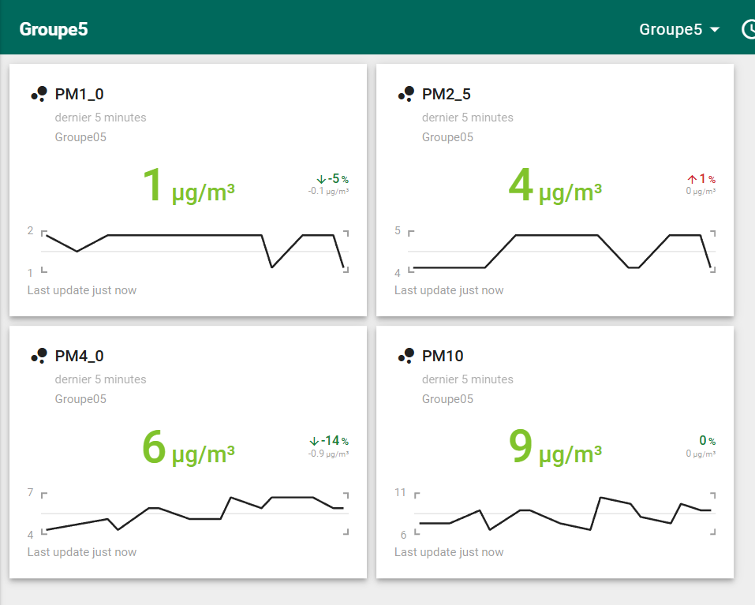

# Dust sensor

The project includes a dust sensor to determine air quality, using a 6tron board and the Mbed environment.


## Import the project

Go to https://github.com/BigYoooo/yohan and clone the project into your working directory.
    
    ```bash
    $ git clone https://github.com/BigYoooo/yohan.git
    ```

## Mbed OS build tools

### Mbed CLI 2
Starting with version 6.5, Mbed OS uses Mbed CLI 2. It uses Ninja as a build system, and CMake to generate the build environment and manage the build process in a compiler-independent manner. If you are working with Mbed OS version prior to 6.5 then check the section [Mbed CLI 1](#mbed-cli-1).
1. [Install Mbed CLI 2](https://os.mbed.com/docs/mbed-os/latest/build-tools/install-or-upgrade.html).
1. Change the current directory to where the project was imported.

### Mbed CLI 1
1. [Install Mbed CLI 1](https://os.mbed.com/docs/mbed-os/latest/quick-start/offline-with-mbed-cli.html).
1. Change the current directory to where the project was imported.

## Application functionality

The application reads particulate matter (PM1.0, PM2.5, PM4.0, PM10) data from the HPMA115 sensor and sends the measurements to a LoRaWAN network server. It also handles LoRaWAN events such as message transmission and reception.

**Note**: This example requires a target device with LoRaWAN and RTOS support. Ensure that your target is configured in `mbed_app.json` with valid LoRaWAN keys and parameters.

## Building and running


1. Connect the HPMA115 sensor to the UART pins of the board and plug the board into your computer using a USB cable.
2. Compile and flash the application onto your board:

    * **Mbed CLI 2**:
    ```bash
    mbed-tools compile -m <TARGET> -t <TOOLCHAIN> --flash
    ```
    * **Mbed CLI 1**:
    ```bash
    mbed compile -m <TARGET> -t <TOOLCHAIN> --flash
    ```

Your PC may take a few minutes to build the application.

The binary is located at:
- **Mbed CLI 2**: `./cmake_build/<TARGET>/develop/<TOOLCHAIN>/project.bin`
- **Mbed CLI 1**: `./BUILD/<TARGET>/<TOOLCHAIN>/project.bin`

Alternatively, you can manually copy the binary to the board via USB.

## Expected output
- The HPMA115 sensor starts measuring particulate matter, and the data is printed to the serial console every second.
- The application transmits the data payload to the LoRaWAN network server at regular intervals (10 seconds by default).
- Received messages from the server are displayed on the serial console.


## Troubleshooting
If you have problems, you can review the [documentation](https://os.mbed.com/docs/latest/tutorials/debugging.html) for suggestions on what could be wrong and how to fix it.

## Related Links

* [Mbed OS Stats API](https://os.mbed.com/docs/latest/apis/mbed-statistics.html).
* [Mbed OS Configuration](https://os.mbed.com/docs/latest/reference/configuration.html).
* [Mbed OS Serial Communication](https://os.mbed.com/docs/latest/tutorials/serial-communication.html).
* [Mbed OS bare metal](https://os.mbed.com/docs/mbed-os/latest/reference/mbed-os-bare-metal.html).
* [Mbed boards](https://os.mbed.com/platforms/).

### License and contributions

The software is provided under Apache-2.0 license. Contributions to this project are accepted under the same license. Please see [CONTRIBUTING.md](./CONTRIBUTING.md) for more info.

This project contains code from other projects. The original license text is included in those source files. They must comply with our license guide.


## Annexes

